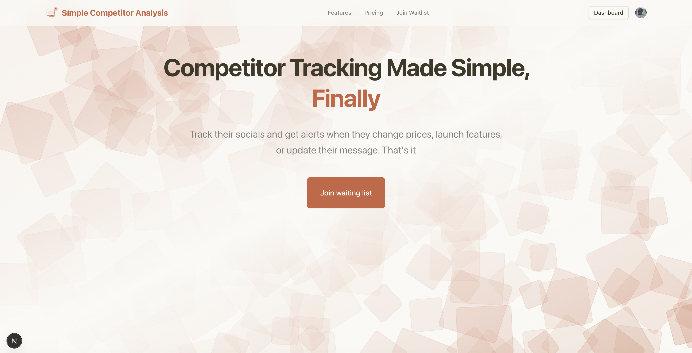
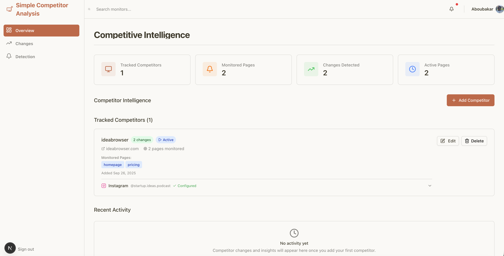
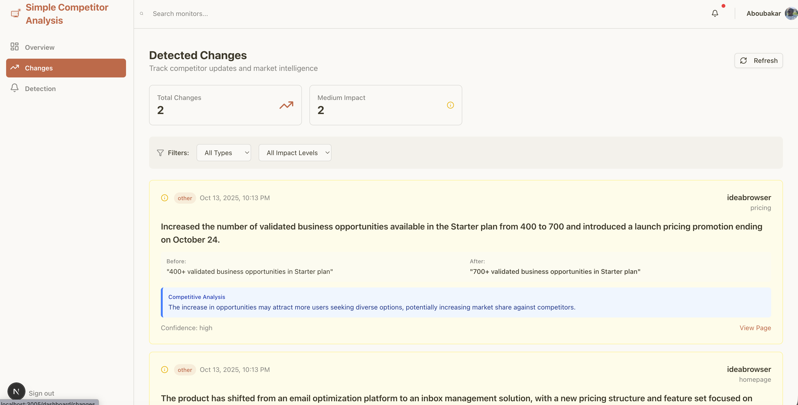

# Website Change Alert

A comprehensive SaaS competitive intelligence platform for monitoring competitor websites and social media, built with Next.js 15, TypeScript, Tailwind CSS, and AI-powered change detection.

https://simplecompetitoranalysis.com/





## Overview

Website Change Alert helps SaaS founders, product managers, and marketers stay ahead of the competition by automatically tracking changes across:

- **Website Monitoring**: Track pricing changes, feature updates, blog posts, and messaging shifts
- **Social Media Monitoring**: Monitor Instagram profiles, posts, and engagement (with support planned for Twitter, Facebook, TikTok, YouTube, LinkedIn)
- **Intelligent Notifications**: AI-powered change detection with automated email alerts and weekly summaries

## Features

### Core Capabilities

- **AI-Powered Change Detection**: Uses OpenAI or Anthropic LLMs to analyze and categorize competitive changes
- **Multi-Platform Monitoring**: Track both websites and Instagram profiles in one unified platform
- **Smart Notifications**: Queue-based email system with retry logic, priority management, and exponential backoff
- **Weekly Summaries**: Automated competitive intelligence digests delivered to your inbox
- **Instagram Scraping**: Monitor competitor Instagram posts, captions, comments, and engagement metrics
- **Date-Filtered Scraping**: Only fetch new content since the last check to optimize API usage
- **Automated Scheduling**: Cron-based monitoring with configurable intervals
- **Change Impact Analysis**: Categorizes changes as high, medium, or low impact with detailed context
- **System Health Monitoring**: Track success rates, average run times, and error analytics

### Technical Features

- **Responsive Design**: Fully fluid and responsive layout that works on all devices
- **Modern UI**: Built with ShadCN UI components for a polished, professional look
- **Performance**: Optimized with Next.js 15 and Turbopack for fast development and builds
- **Type Safety**: Full TypeScript coverage throughout the application
- **Authentication**: Integrated with Clerk for secure user authentication
- **Database**: Prisma ORM for type-safe database operations with PostgreSQL
- **Web Scraping**: Apify integration for website and Instagram scraping
- **Email Delivery**: Resend for reliable transactional emails with template support
- **Analytics**: Vercel Analytics for user tracking and insights

## Technical Stack

### Frontend & Framework
- **Framework**: Next.js 15 with App Router
- **Language**: TypeScript 5
- **Styling**: Tailwind CSS v4 with custom color scheme
- **UI Components**: ShadCN UI (new-york style)
- **Icons**: Lucide React
- **Fonts**: Geist Sans and Geist Mono
- **Build Tool**: Turbopack

### Backend & Infrastructure
- **API**: Next.js API Routes
- **Database**: PostgreSQL with Prisma ORM 6.15.0
- **Authentication**: Clerk (@clerk/nextjs 6.31.5)
- **Security**: Crypto-js for hashing

### External Services
- **Web Scraping**: Apify Client (website and Instagram scraping)
- **Email**: Resend (transactional emails with templates)
- **Analytics**: Vercel Analytics
- **LLM**: OpenAI or Anthropic (configurable)

## Database Schema

The application uses 15 Prisma models organized into three main areas:

### Website Monitoring Models
- **User**: User accounts with company info and role
- **Company**: Competitor companies being monitored
- **MonitoredPage**: Website pages to track (pricing, features, blog, etc.)
- **PageSnapshot**: Historical snapshots of page content
- **SaasChange**: Detected website changes with impact analysis
- **ChangeDetectionRun**: Website monitoring run tracking

### Social Media Models
- **SocialProfile**: Instagram/social profiles (platform, handle, URL)
- **SocialSnapshot**: Social media snapshots with metrics (followers, posts, etc.)
- **SocialChange**: Social changes (bio updates, follower milestones, post updates)
- **SocialDetectionRun**: Social monitoring run tracking

### Notification & System Models
- **EmailTemplate**: Email templates (pricing_alert, feature_alert, weekly_summary, instagram_scrape_complete)
- **NotificationQueue**: Queue for pending/sent notifications with retry logic
- **Notification**: Notification history and tracking
- **TestScenario**: Test scenarios for change detection
- **WaitlistEntry**: Landing page waitlist

## Key Services

### Instagram Scraper Service
- Scrapes Instagram profiles using Apify
- Captures posts, captions, comments, and timestamps
- Supports date filtering (onlyPostsNewerThan)
- Returns up to 10 most recent posts per scrape
- Location: `src/lib/instagram-scraper.ts:1`

### Social Detection Service
- Orchestrates social media monitoring workflow
- Creates snapshots with metrics extraction
- Tracks profile changes over time (bio, followers, posts)
- Sends email notifications on scrape completion
- System health monitoring with success rates
- Location: `src/lib/socials-service.ts:1`

### Email Service
- Resend integration for reliable email delivery
- Mustache-style template processing with variable substitution
- Notification queue management with retry logic (max 3 retries)
- Exponential backoff for failed emails (5min, 15min, 60min)
- Supports immediate and scheduled notifications
- Location: `src/lib/email-service.ts:1`

### Notification Engine
- Automatic notifications for all detected changes
- Priority-based queuing (high/medium/low)
- Handles both website and social media changes
- Weekly summary generation
- Smart notification delays based on impact level
- Location: `src/lib/notification-engine.ts:1`

### Change Detection Service
- Website scraping via Apify
- Content processing and comparison
- LLM-powered change analysis with impact categorization
- Automatic notification triggering
- System health monitoring
- Location: `src/lib/change-detection-service.ts:1`

## Email Templates

Four built-in email templates with beautiful HTML formatting:

1. **pricing_alert**: Pricing change notifications with before/after comparison
2. **feature_alert**: Feature/product updates (also used for social changes)
3. **instagram_scrape_complete**: Instagram scrape success notifications with latest posts
4. **weekly_summary**: Weekly competitive intelligence digest

All templates support Mustache-style variables and array iteration for dynamic content.

## API Routes

### Change Detection
- `POST /api/change-detection/run` - Trigger detection run
- `POST /api/change-detection/schedule` - Schedule monitoring
- `GET /api/change-detection/status` - Check run status

### Social Media
- `POST /api/socials/schedule` - Schedule social monitoring
- `GET /api/socials/status` - Check social run status
- `POST /api/instagram/scrape` - Manual Instagram scrape
- `GET /api/instagram/handle/[companyId]` - Get Instagram handle
- `PUT /api/instagram/handle/[companyId]` - Update Instagram handle
- `GET /api/instagram/handle` - List all handles

### Competitors
- `GET /api/competitors` - List all competitors
- `POST /api/competitors` - Create new competitor
- `GET /api/competitors/[id]` - Get competitor details
- `PUT /api/competitors/[id]` - Update competitor
- `DELETE /api/competitors/[id]` - Delete competitor
- `GET /api/competitors/[id]/pages` - List monitored pages

### Notifications
- `POST /api/notifications/process-queue` - Process pending notifications
- `POST /api/notifications/test` - Send test notifications
- `POST /api/email/seed-templates` - Seed email templates

### Other
- `GET /api/changes` - List all detected changes
- `POST /api/detect-pages` - Auto-detect pages to monitor
- `POST /api/sync-user` - Clerk user sync webhook
- `POST /api/waitlist` - Waitlist signup
- `GET /api/health` - Health check endpoint
- `POST /api/cron/process-notifications` - Cron job for notification processing

## Getting Started

### Prerequisites

- Node.js 18+ and npm
- PostgreSQL database
- Clerk account (for authentication)
- Apify account (for scraping)
- Resend account (for emails)
- OpenAI or Anthropic API key (for AI-powered change detection)

### Installation

1. **Clone the repository and install dependencies:**
   ```bash
   npm install
   ```

2. **Set up environment variables:**

   Copy `.env.example` to `.env.local` and configure:

   **Database:**
   ```env
   DATABASE_URL="postgresql://..."
   DIRECT_URL="postgresql://..."  # Optional
   ```

   **Authentication (Clerk):**
   ```env
   NEXT_PUBLIC_CLERK_PUBLISHABLE_KEY="pk_..."
   CLERK_SECRET_KEY="sk_..."
   ```

   **LLM Provider (choose one):**
   ```env
   LLM_PROVIDER="openai"  # or "anthropic" or "mock"
   OPENAI_API_KEY="sk-..."  # If using OpenAI
   ANTHROPIC_API_KEY="sk-ant-..."  # If using Anthropic
   LLM_MODEL="gpt-4"  # Optional, provider-specific
   LLM_TEMPERATURE="0.3"  # Optional, default 0.3
   LLM_MAX_TOKENS="500"  # Optional, default 500
   ```

   **Email Service (Resend):**
   ```env
   RESEND_API_KEY="re_..."
   EMAIL_FROM="noreply@yourdomain.com"  # Optional
   ```

   **Web Scraping (Apify):**
   ```env
   APIFY_API_TOKEN="apify_api_..."
   ```

   **Application:**
   ```env
   NEXT_PUBLIC_APP_URL="http://localhost:3005"  # Optional
   ```

   **Testing:**
   ```env
   TEST_USE_REAL_LLM="false"  # Optional, default false
   ```

3. **Set up the database:**
   ```bash
   # Generate Prisma client
   npx prisma generate

   # Run migrations
   npx prisma migrate dev

   # Seed email templates (important!)
   npm run dev  # Start dev server first
   # Then in another terminal:
   curl -X POST http://localhost:3005/api/email/seed-templates
   ```

4. **Run the development server:**
   ```bash
   npm run dev
   ```

5. **Open your browser:**

   Navigate to [http://localhost:3005](http://localhost:3005)

### Setting Up Automated Monitoring

To enable automated change detection and notifications, set up these cron jobs:

```bash
# Process notification queue every 5 minutes
*/5 * * * * curl -X POST http://localhost:3005/api/cron/process-notifications

# Run website change detection (adjust frequency as needed)
0 */6 * * * curl -X POST http://localhost:3005/api/change-detection/run

# Run social media detection (adjust frequency as needed)
0 */12 * * * curl -X POST http://localhost:3005/api/socials/schedule
```

For production, use a service like Vercel Cron, GitHub Actions, or a dedicated cron service.

## Development Commands

- **Development server**: `npm run dev` (uses Turbopack on port 3005)
- **Debug mode**: `npm run dev:debug` (development with Node.js inspector)
- **Build**: `npm run build` (production build with Prisma generate + Turbopack)
- **Start**: `npm start` (starts production server)
- **Lint**: `npm run lint` (ESLint with Next.js presets)

## Project Structure

```
src/
├── app/
│   ├── layout.tsx                # Root layout with metadata and Vercel Analytics
│   ├── page.tsx                  # Landing page
│   ├── globals.css               # Global styles with theme variables
│   ├── dashboard/                # Dashboard pages
│   │   ├── page.tsx              # Main dashboard
│   │   ├── changes/              # Changes view
│   │   ├── detection/            # Detection management
│   │   └── notifications/        # Notification management
│   └── api/                      # API routes (see API Routes section)
├── components/
│   ├── ui/                       # ShadCN UI components
│   ├── Navbar.tsx                # Navigation component
│   ├── Hero.tsx                  # Hero section
│   └── Logo.tsx                  # Logo component
├── lib/
│   ├── utils.ts                  # Utility functions
│   ├── change-detection-service.ts  # Website monitoring
│   ├── socials-service.ts        # Social media monitoring
│   ├── instagram-scraper.ts      # Instagram scraping
│   ├── email-service.ts          # Email delivery
│   ├── notification-engine.ts    # Notification orchestration
│   ├── email-templates.ts        # Email template definitions
│   └── llm-client.ts             # LLM provider abstraction
└── prisma/
    └── schema.prisma             # Database schema
```

## Path Aliases

- `@/components` → `src/components`
- `@/lib` → `src/lib`
- `@/` → `src/`

## Development Patterns

### Component Development
- Use functional components with proper TypeScript typing
- Import UI components from `@/components/ui/`
- Use semantic color classes (e.g., `text-foreground`, `bg-background`)
- Follow existing naming conventions for consistency

### Styling Guidelines
- Use Tailwind utility classes with semantic color variables
- Prefer responsive design patterns (`sm:`, `md:`, `lg:` breakpoints)
- Maintain consistent spacing and typography scales
- Use backdrop blur and transparency for overlay effects

### File Organization
- Keep components in appropriate directories (`ui/` for reusable UI, root level for page-specific)
- Use TypeScript for all new files
- Follow Next.js App Router conventions for routing and layouts

### Service Layer Patterns
- All services return structured results with success/error states
- Use Prisma transactions for multi-step database operations
- Implement retry logic for external API calls
- Log important events and errors for debugging

## Configuration Files

- `components.json` - ShadCN UI configuration (new-york style)
- `tailwind.config.js` - Tailwind CSS configuration
- `tsconfig.json` - TypeScript configuration with path aliases
- `prisma/schema.prisma` - Database schema definitions
- `.env.example` - Environment variable template

## Production Deployment Checklist

- [ ] Set up PostgreSQL database (Vercel Postgres, Supabase, etc.)
- [ ] Configure all environment variables in production
- [ ] Run database migrations: `npx prisma migrate deploy`
- [ ] Seed email templates via `/api/email/seed-templates`
- [ ] Set up Clerk authentication with production domain
- [ ] Configure Resend with your domain for email delivery
- [ ] Set up cron jobs for automated monitoring
- [ ] Configure LLM provider (OpenAI or Anthropic) with production API keys
- [ ] Test notification delivery end-to-end
- [ ] Enable Vercel Analytics
- [ ] Set up error monitoring (Sentry, etc.)
- [ ] Configure rate limiting for API routes
- [ ] Review and adjust monitoring intervals based on usage

## Architecture Overview

### Monitoring Workflow

1. **Scheduled Trigger**: Cron job triggers detection run
2. **Scraping**: Apify fetches website/Instagram content
3. **Snapshot Creation**: New snapshot stored in database
4. **Change Detection**: LLM compares snapshots and identifies changes
5. **Impact Analysis**: Changes categorized by impact (high/medium/low)
6. **Notification Queuing**: Notifications added to queue with priority
7. **Email Processing**: Queue processor sends emails with retry logic
8. **User Notification**: User receives email with change details

### Service Dependencies

```
Change Detection Service
  ├─→ Apify (scraping)
  ├─→ LLM Client (OpenAI/Anthropic)
  └─→ Notification Engine
       └─→ Email Service
            └─→ Resend API

Social Detection Service
  ├─→ Instagram Scraper
  │    └─→ Apify
  └─→ Notification Engine
       └─→ Email Service
            └─→ Resend API
```

## Contributing

This is a personal project, but suggestions and feedback are welcome. Please open an issue to discuss proposed changes.

## License

Private project - All rights reserved.

## Support

For questions or issues with the codebase, please open an issue on the repository.

---

Built with ❤️ for SaaS founders who want to stay ahead of the competition.
